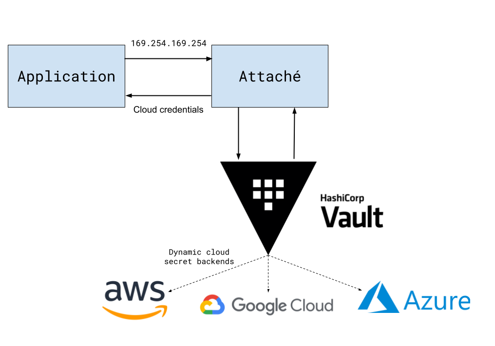

# Attaché

[](http://golang.org) 

Attaché provides an emulation layer for cloud provider instance metadata APIs, allowing for seamless multi-cloud IAM using Hashicorp Vault.

<p align="center">
  <a href="./attache.png"></a>
</p>


## How it works

1. Attaché intercepts requests that applications perform to the cloud provider's instance metadata service (IMDS)
2. Attaché forwards these requests to a pre-configured cloud secrets backend of Hashicorp Vault to retrieve application-scoped cloud credentials
3. Finally, Attaché returns the requested credentials to the application

## Installation

You can use the pre-built binaries from the [releases page](https://github.com/DataDog/attache/releases) or use the provided Docker image:

```
docker run --rm -it docker pull ghcr.io/datadog/attache
```

## Sample usage

In this example, we will use Attaché to have a local application that uses the AWS and Google Cloud SDKs to seamlessly retrieve cloud credentials.

### 1. Set up a Vault server

```bash
vault server -dev -dev-root-token-id=local -log-level=DEBUG
```
### 2. Set up your application roles in AWS and Google Cloud

Create an AWS IAM role caled `application-role`, and a Google Cloud service account called `application-role` (they have to match).

### 3. Configure your Vault AWS secrets backend

Let's mount an AWS secret backend. For this demo, we'll authenticate Vault to AWS using IAM user access keys, which is (to say the least) a bad practice not to follow in production:

Create an AWS IAM user:

```bash
accountId=$(aws sts get-caller-identity --query Account --output text)
aws iam create-user --user-name vault-demo
credentials=$(aws iam create-access-key --user-name vault-demo)
accessKeyId=$(echo "$credentials" | jq -r '.AccessKey.AccessKeyId')
secretAccessKey=$(echo "$credentials" | jq -r '.AccessKey.SecretAccessKey')
```

Allow Vault to assume the role we want to give our application:

```bash
aws iam put-user-policy --user-name vault-demo --policy-name vault-demo --policy-document '{
  "Version": "2012-10-17",
  "Statement": [
    {
      "Effect": "Allow",
      "Action": "sts:AssumeRole",
      "Resource": "arn:aws:iam::'$accountId':role/application-role"
    },
    {
      "Sid": "AllowVaultToRotateItsOwnCredentials",
      "Effect": "Allow",
      "Action": ["iam:GetUser", "iam:DeleteAccessKey", "iam:CreateAccessKey"],
      "Resource": "arn:aws:iam::'$accountId':user/vault-demo"
    }
  ]
}'
```

Then we configure the Vault AWS credentials backend:

```bash
# Point the Vault CLI to our local test server
export VAULT_ADDR="http://127.0.0.1:8200"
export VAULT_TOKEN="local"

vault secrets enable -path cloud-iam/aws/0123456789012 aws
vault write cloud-iam/aws/0123456789012/config/root access_key="$accessKeyId" secret_key="$secretAccessKey"
vault write cloud-iam/aws/0123456789012/roles/application-role credential_type=assumed_role role_arns="arn:aws:iam::${accountId}:role/application-role"
vault write -f cloud-iam/aws/0123456789012/config/rotate-root # rotate the IAM user access key so Vault only knows its own static credentials
```

We can confirm that Vault is able to retrieve our role credentials by using `vault read cloud-iam/aws/0123456789012/creds/application-role`.

### 4. Configure your Vault GCP secrets backend

Let's mount a Google Cloud secret backend. For this demo, we'll authenticate Vault to GCP using a service account key, which is also suboptimal in production:

```bash
project=$(gcloud config get-value project)
vaultSa=vault-demo@$project.iam.gserviceaccount.com
gcloud iam service-accounts create vault-demo
gcloud iam service-accounts keys create gcp-creds.json --iam-account=$vaultSa

# Allow the Vault service account to impersonate the application service account
gcloud iam service-accounts add-iam-policy-binding application-role@$project.iam.gserviceaccount.com \
  --role=roles/iam.serviceAccountTokenCreator \
  --member=serviceAccount:$vaultSa
```

Then we configure the Vault GCP credentials backend, so it can access our prerequisite

```bash
gcloud 
vault secrets enable -path cloud-iam/gcp/gcp-sandbox gcp
vault write cloud-iam/gcp/gcp-sandbox/config credentials=@gcp-creds.json
vault write cloud-iam/gcp/gcp-sandbox/impersonated-account/application-role service_account_email="application-role@gcp-sandbox.iam.gserviceaccount.com" token_scopes="https://www.googleapis.com/auth/cloud-platform" ttl="4h"
```

We can verify this worked by running `vault read cloud-iam/gcp/gcp-sandbox/impersonated-account/application-role/token`

### 5. Configure and run Attaché

Let's create a configuration file for Attaché (see [Configuration reference](#configuration-reference)):

```
##
# Attaché global configuration
##
server:
  bind_address: 127.0.0.1:8080
  graceful_timeout: 0s
  rate_limit: ""

# We're running locally
provider: ""
region: ""
zone: ""
  
# AWS configuration
aws_vault_mount_path: cloud-iam/aws/012345678901
iam_role: application-role
imds_v1_allowed: false

# GCP configuration
gcp_vault_mount_path: cloud-iam/gcp/gcp-sandbox
gcp_project_ids:
    cloud-iam/gcp/gcp-sandbox: "712781682929"  

# Azure configuration (unused here)
azure_vault_mount_path: ""
```

Then we can run Attaché:

```
$ export VAULT_ADDR="http://127.0.0.1:8200"
$ export VAULT_TOKEN="local"
$ attache ./config.yaml
2024-06-17T16:51:23.283+0200	DEBUG	attache/main.go:35	loading configuration	{"path": "./config.yaml"}
2024-06-17T16:51:23.283+0200	DEBUG	attache/main.go:49	configuration loaded	{"configuration": {"IamRole":"application-role","IMDSv1Allowed":false,"GcpVaultMountPath":"cloud-iam/gcp/gcp-sandbox","GcpProjectIds":{"cloud-iam/gcp/gcp-sandbox":"712781682929"},"AwsVaultMountPath":"cloud-iam/aws/012345678901","AzureVaultMountPath":"","ServerConfig":{"BindAddress":"127.0.0.1:8080","GracefulTimeout":0,"RateLimit":""},"Provider":"","Region":"","Zone":""}}
2024-06-17T16:51:23.284+0200	INFO	cloud-iam-server	server/server.go:110	server starting	{"address": "127.0.0.1:8080"}
```

Note how we're able to manually retrieve credentials as if we were hitting the AWS IMDS, which Attaché emulates:

```bash
$ IMDSV2_TOKEN=$(curl -XPUT localhost:8080/latest/api/token -H x-aws-ec2-metadata-token-ttl-seconds:21600)

$ curl -H "X-aws-ec2-metadata-token: $IMDSV2_TOKEN" localhost:8080/latest/meta-data/iam/security-credentials/
application role

$ curl -H "X-aws-ec2-metadata-token: $IMDSV2_TOKEN" localhost:8080/latest/meta-data/iam/security-credentials/application-role
{
  "AccessKeyId": "ASIAZ3..",
  "Code": "Success",
  "SecretAccessKey": "liqX1...",
  "Token": "IQoJ...",
}
```

Same as if we were hitting the GCP IMDS:

```bash
$ curl -H Metadata-Flavor:Google localhost:8080/computeMetadata/v1/instance/service-accounts/
default/
application-role@gcp-sandbox.iam.gserviceaccount.com/

$ curl -H Metadata-Flavor:Google localhost:8080/computeMetadata/v1/instance/service-accounts/application-role@gcp-sandbox.iam.gserviceaccount.com/
default/
{
  "access_token": "ya29.c.c0AY_VpZ...",
  "token_type": "Bearer",
  "expires_in": 3597
}
```

### 6. Run your application

Let's use the following application that lists AWS S3 and Google Cloud GCS buckets:

```python
import boto3
from google.cloud import storage

def list_s3_buckets():
    s3 = boto3.client('s3')
    
    response = s3.list_buckets()    
    print(f"Found {len(response['Buckets'])} AWS S3 buckets!")

def list_gcs_buckets():
    client = storage.Client()
    
    buckets = client.list_buckets()
    print(f"Found {len(list(buckets))} GCS buckets!")

list_s3_buckets()
list_gcs_buckets()
```

We can set the required environment variables to point to Attaché:

```bash
export AWS_EC2_METADATA_SERVICE_ENDPOINT="http://127.0.0.1:8080/"
export GCE_METADATA_HOST="127.0.0.1:8080"
```

... and then run it!

```bash
pip install boto3 google-cloud-storage
python app.py
```

We see:

```bash
Found 154 AWS S3 buckets!
Found 2 GCS buckets!
```

And in the Attaché logs:

```
2024-06-17T17:23:15.463+0200	INFO	cloud-iam-server	server/server.go:170	request	{"address": "127.0.0.1:8080", "path": "/latest/api/token", "method": "PUT", "userAgent": "Boto3/1.34.77 Python/3.10.13 Darwin/23.5.0 Botocore/1.34.80"}
2024-06-17T17:23:15.463+0200	INFO	cloud-iam-server	server/server.go:177	response	{"address": "127.0.0.1:8080", "path": "/latest/api/token", "method": "PUT", "statusCode": 200, "userAgent": "Boto3/1.34.77 Python/3.10.13 Darwin/23.5.0 Botocore/1.34.80"}
2024-06-17T17:23:15.464+0200	INFO	cloud-iam-server	server/server.go:170	request	{"address": "127.0.0.1:8080", "path": "/latest/meta-data/iam/security-credentials/", "method": "GET", "userAgent": "Boto3/1.34.77 Python/3.10.13 Darwin/23.5.0 Botocore/1.34.80"}
2024-06-17T17:23:15.465+0200	INFO	cloud-iam-server	server/server.go:177	response	{"address": "127.0.0.1:8080", "path": "/latest/meta-data/iam/security-credentials/", "method": "GET", "statusCode": 200, "userAgent": "Boto3/1.34.77 Python/3.10.13 Darwin/23.5.0 Botocore/1.34.80"}
2024-06-17T17:23:15.466+0200	INFO	cloud-iam-server	server/server.go:170	request	{"address": "127.0.0.1:8080", "path": "/latest/meta-data/iam/security-credentials/application-role", "method": "GET", "userAgent": "Boto3/1.34.77 Python/3.10.13 Darwin/23.5.0 Botocore/1.34.80"}
2024-06-17T17:23:15.895+0200	DEBUG	token maintainer	cache/maintainer.go:188	Updating cached value	{"fetcher": "aws-sts-token-vault", "expiration": "2024-06-17T16:23:14.000Z"}
2024-06-17T17:23:15.895+0200	DEBUG	token maintainer	cache/maintainer.go:201	scheduling value refresh	{"fetcher": "aws-sts-token-vault", "delay": "20m22.713030691s"}
2024-06-17T17:23:15.895+0200	INFO	cloud-iam-server	server/server.go:177	response	{"address": "127.0.0.1:8080", "path": "/latest/meta-data/iam/security-credentials/application-role", "method": "GET", "statusCode": 200, "userAgent": "Boto3/1.34.77 Python/3.10.13 Darwin/23.5.0 Botocore/1.34.80"}
```

## Considerations for running in production

TBA

## Caching

TBA

## Configuration reference

```yaml
##
# Attaché global configuration
##
server:
  bind_address: 127.0.0.1:8080
  graceful_timeout: 0s
  rate_limit: ""

# If applicable, the current cloud environment where attaché is running
provider: ""

# If applicable, current cloud region (e.g., us-east-1a) where attaché is running
region: ""

# If applicable, current cloud availability zone (e.g., us-east-1a) where attaché is running
zone: ""
  
##
# AWS configuration
##

# Vault path where the AWS secrets backend is mounted
aws_vault_mount_path: cloud-iam/aws/012345678901

# The AWS IAM role name that Attaché will assume to retrieve AWS credentials
iam_role: my-role

# Disable IMDSv1
imds_v1_allowed: false

##
# GCP configuration
##

# Vault pathw here the Google Cloud secrets backend is mounted
gcp_vault_mount_path: cloud-iam/gcp/my-gcp-sandbox

# Mapping of Vault paths to Google Cloud project IDs
gcp_project_ids:
    cloud-iam/gcp/datadog-sandbox: "012345678901"  

##
# Azure configuration
##
azure_vault_mount_path: cloud-iam/azure/my-azure-role
```
